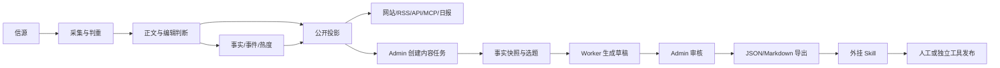

# AI 薅羊毛资讯与内容工作台

## 1. 产品定位

面向 AI 福利、限时免费、额度活动、价格变化、优惠技巧和相关状态变化的资讯站：持续采集、核验、归组并公开展示可靠信息；管理员从已确认资讯创建、审核和导出自媒体内容素材。

本版本以当前仓库真实的 Web/API/Worker/Admin/PostgreSQL 架构为准，替代旧版 CLI、JSON/JSONL 主存储、无后台和自动平台发布假设。

### 目标用户

- 公开读者：匿名阅读，不需要账号。
- 管理员/编辑：维护信源、处理资讯、复核事实、生产和导出内容。

本版本不做多租户、订阅和复杂协作权限。

## 2. 产品边界

### 包含

1. AI 福利与薅羊毛资讯的采集、判重、正文提取、模型分析、精选、事件归组、热度和日报。
2. 免费额度、限时活动、新用户福利、价格变化、兑换机会、工具优惠和使用技巧的结构化表达。
3. 公开网站、日报、RSS、公开 API、MCP 和 `llms.txt`。
4. Admin 内容链路诊断、人工修正、可见性、SEO、重跑、事件归组、审计和预算管理。
5. 从精选文章、事实或事件创建内容任务、生成平台草稿、人工审核和导出。
6. 外挂 Skills 读取结构化素材并生成平台化文案、图片、HTML、脚本或素材包。

### 不包含

- 核心项目不自动发布到小红书、抖音、公众号等平台。
- 不在核心项目保存平台 Cookie、密码、账号 Token 或登录态。
- 未经 Admin 审核的模型草稿不得成为公开内容或导出成稿。
- 不把平台文案生成混入采集、精选或日报的强制链路。
- 不鼓励批量注册、绕过风控、滥用优惠或违反平台条款。
- 不设计与现有 Codex 监控、Leaderboard、publication 重复的状态、价格或公开读取机制。

## 3. 当前架构基线

| 组件 | 路径 | 职责 |
|---|---|---|
| API | `apps/api/` | Fastify；自用 API、公开 API、RSS、MCP、Admin、图片代理和分享图 |
| Worker | `apps/worker/` | pg-boss 队列及定时任务；采集、抽取、模型分析、归组、热度、日报、监控和通知 |
| Web | `apps/web/` | React Router SSR；公开站和 Admin，页面只通过 HTTP 读取 API |
| 业务 | `packages/backend/` | 内容处理、编辑判断、publication、事件、日报、Provider、监控、Leaderboard 和 Admin |
| 合约 | `packages/contracts/` | 前后端共享类型、时间、分类、HTTP 和领域契约 |
| 行业包 | `industry/` | `site.ts`、`taxonomy.ts`、`topics.json`、`sources.json`、提示词、门槛、品牌、条款和功能开关 |
| 数据库 | PostgreSQL | 文章、修订、分析、公开投影、事件、日报、监控、模型资料、运行状态和审计 |

### 不可破坏规则

1. 所有公开出口从 `packages/backend/src/publication/` 的统一读取层获得内容。
2. 页面加载不调用模型；模型只在 Worker 中调用。
3. 付费 Provider 请求必须经过 `packages/backend/src/providers/receipts.ts` 的回执和预算熔断。
4. `COLLECT_ENABLED`、`MODEL_CALLS_ENABLED`、`FEISHU_CONTENT_PUSH_ENABLED`、`FEISHU_INTERNAL_ENABLED`、`INDEXNOW_SUBMIT_ENABLED` 是安全阀，开发测试默认关闭。
5. 公开内容匿名；Admin 操作必须经管理员会话、CSRF、版本冲突保护和审计。
6. 来源、文章修订、人工修改、模型结果和公开投影必须可追溯。
7. 历史回灌不进入当日热度或重复推送。
8. 公开资讯与自媒体草稿分层；草稿不能反向修改事实。

## 4. 已有能力和复用先例

### 4.1 资讯主链路

现有数据流为：

```text
信源 → articles/article_discoveries 判重 → 正文修订
→ 编辑判断与写作 → stories/facts 事件归组和热度
→ publications 统一公开投影 → 网站/RSS/API/MCP/日报
```

`packages/backend/src/content/materials.ts` 已有 `MaterialInput`、`upsertMaterial`、`identityKeyFor`、`contentHash` 和历史时间线判断；`jobs/content.ts` 已有正文提取、模型分析、重试、Receipt 等待和失败重入队；`publication/publish.ts` 已有 `publishArticle`、人工覆盖合并和 `selected_ledger` 精选变化记录。

### 4.2 Codex 重置监控：状态机制先例

`industry/features.ts` 的 `codexResetMonitor` 和 `docs/leaderboard.md` 对应模块已实现：

- 采集指定 X 账号的重置帖子；
- 模型只识别、翻译并提出命题；
- 状态由代码规则决定，模型措辞不能直接确认事实；
- 事件支持预告、进行中、确认、预计窗口已过但未确认、可能已完成等展示状态；
- Admin 可改事件、重关联帖子、人工确认、撤回、恢复和处理待复核帖子；
- 使用版本检查、审计日志和统一公开读层；
- 页面与 `GET /api/v1/codex-resets` 和 `GET /api/v1/codex-resets/recent` 读取同一事件快照；
- 可按配置通过飞书推送预告和确认。

涉及实现：`monitor/recognize.ts`、`monitor/assemble.ts`、`monitor/read.ts`、`admin/monitor.ts`。其中 `PresentationStatus` 已区分 `announced`、`in_progress`、`confirmed`、`expired_unconfirmed`、`likely_completed`；预计时间过去不会自动等于确认。

**复用决策**：AI 福利活动不另造一套“状态变化识别”。采用同一原则：模型提议事实，代码计算状态，管理员处理不确定性，公开出口读取统一快照。具体业务字段可以不同，事实确认和展示推测必须分开。

### 4.3 Leaderboard：模型与价格资料先例

`leaderboard` 已实现模型名录、评测快照、官方价格和访问属性：

- 模型名称、厂商、发布日期和别名来自 `database/seeds/`；
- 官方 API 价格由价格 seed 导入；更新命令为 `node --env-file=.env scripts/import-leaderboard-prices.ts`；
- `packages/backend/src/leaderboard/model-weights.json` 只登记精确核验过的官方权重仓库；
- `leaderboard/access.ts` 判断厂商归属和开放权重展示；
- 未核验的新模型不会自动宣称开放权重或可商用；筛选不重新计算原排名。

**复用决策**：福利资讯中的模型、平台、厂商、价格、额度、货币、计费单位和可用性应结构化并保留来源与时间。`免费`、`开放权重`、`可商用`、`国内可用`是不同事实，不能互相推导。

## 5. 资讯范围与事实要求

### 类型

| 类型 | 必须关注的事实 |
|---|---|
| 限时免费 | 开始/结束、产品、原价、限制 |
| 新用户福利 | 资格、领取方式、额度、有效期 |
| API 额度 | 周期、RPM/TPM、并发、模型范围 |
| 价格变化 | 原价、现价、货币、计费单位、生效时间 |
| 兑换活动 | 兑换码、地区、资格、过期时间 |
| 工具优惠 | 资格、权益、续费、取消方式 |
| 使用技巧 | 前置条件、步骤、风险 |
| 状态变化 | 变化前后、证据、发生时间 |

每条可传播事实尽量包含：提供方和产品/模型、原始链接、适用对象、额度/价格/权益、时间范围或重置周期、地区/账号/支付/实名限制、当前状态、最后核验时间、风险说明。缺失值必须显示“未公开”或“待核验”，模型不得猜测补全。

## 6. 数据流和产品分层



资讯站是事实和公开展示产品；Admin 是编辑与内容生产产品；外挂 Skill 是平台适配工具。内容任务主动读取已入库事实，不重新抓取同一来源。事实变化时，关联未导出草稿必须提示复核。导出不等于发布；`published_externally` 如未来需要，只表示管理员人工确认的外部结果。

## 7. Admin 内容工作台
命名边界：本工作台规划模块统称 `studio`（页面 `/admin/studio`、表 `studio_*`）。后端遵循仓库惯例：管理域业务逻辑放 `packages/backend/src/admin/studio.ts`（任务/审核/导出），生成任务放 `packages/backend/src/jobs/studio.ts`，不新开 `studio/` 目录。仓库已有的 `packages/backend/src/editorial/` 是站点文章的分析与写作（analyze、writing、prompts 加载），与本工作台无关；不得把工作台代码放进 `editorial/`，也不得占用它的目录名。

### 7.1 内容任务

规划实体 `StudioTask`：

- `id`、`title`、`status`、`angle`、`audience`、`target_platforms`；
- `source_refs`：文章、事实、事件或日报引用；
- `fact_snapshot`：生成时使用的事实版本；
- `priority`、`version`（乐观锁）、`created_by`、`created_at`、`updated_at`、`archived_at`。

任务状态：`draft` → `in_progress` → `needs_review` → `approved` → `exported`；另有 `archived`。审核、导出、归档和状态回退都写审计。

### 7.2 事实素材卡

事实卡不是最终文案，包含标题、提供方、产品/模型、福利类型、价格/额度、时间、重置周期、条件、地区、步骤、风险、原文链接、引用片段、证据状态、核验时间和版本。

实现前优先评估复用现有 `facts`、`stories`、`reports` 和 JSONB，不为方便重复建文章/事件表。

### 7.3 平台草稿

规划实体 `StudioDraft`：

- `id`、`task_id`、`platform`、`version`、`status`、`content`；
- `citations`、`input_snapshot`、`model`、`prompt_version`；
- `review_reason`、`created_by`、`created_at`。

P1 支持通用选题卡、小红书图文、抖音图文/短视频脚本、公众号文章和社群短文案。每个关键数字必须绑定事实字段或来源引用；不得凭空添加“无限”“永久”“保证”等表述。

### 7.4 审核

管理员核对活动有效性、额度/日期/价格/链接、领取条件、地区/实名/支付/续费限制、平台合规和风险提示。模型只能提出标题、结构和草稿。生成失败只影响草稿，不影响公开资讯。

## 8. 外挂 Skills

### 输入契约

Skill 通过 Admin 导出的 JSON 或 Markdown 工作包运行，不直连核心数据库：

```json
{
  "taskId": "content-task-id",
  "facts": [{
    "title": "事实标题",
    "provider": "平台名",
    "benefit": "每日免费额度",
    "conditions": ["条件"],
    "status": "active",
    "verifiedAt": "2026-10-01T00:00:00+08:00",
    "sourceUrl": "https://example.com/source"
  }],
  "angle": "省钱上手",
  "audience": "开发者",
  "platform": "xiaohongshu"
}
```

### 输出契约

输出包含平台、标题候选、正文/脚本、标签、图片/分镜建议、事实引用、未解决问题、人工风险提醒、生成时间和 Skill 版本。可生成 Markdown、HTML、JSON、图片、脚本和素材包。

### 禁止事项

Skill 不得修改事实、绕过审核、标记已发布、保存平台凭据、批量注册、刷量、规避限制或默认调用平台非公开发布接口。

## 9. 状态模型

### 资讯/福利事件

建议表达为：`proposed`、`unverified`、`announced`、`active`、`expiring`、`expired`、`quota_exhausted`、`changed`、`withdrawn`。不同事件可以使用子集，但事实状态和展示推测分开。不能仅因预计时间已过就写成 `confirmed`；应保留类似 Codex 的 `expired_unconfirmed` / `likely_completed` 语义。

### 草稿

```text
draft → generated → needs_review → approved → exported
```

`published_externally` 只能由管理员人工确认，不能由导出或时间推断。

### 事实变化

事实过期、变化或撤回时：更新 publication；记录证据；标记关联未导出草稿需复核；已导出草稿保留历史但显示失效提示；不自动修改平台外部内容。

## 10. 页面、接口和任务

### 现有公开入口

`/`、`/all`、`/hot`、`/topics`、`/daily`、`/weekly`、`/monthly`、`/feed.xml` 等 RSS、`/api/v1/`、`/api/mcp`、`/llms.txt`；功能开启时还有 `/codex-reset`、`/api/v1/codex-resets` 和 `/leaderboard`。

### 现有 Admin

`/admin`、`/admin/content`、`/admin/content/:id`、`/admin/sources`、`/admin/monitor`、`/admin/runs`、`/admin/models`、`/admin/selectbench`、`/admin/settings`、`/admin/audit`。内容页已有信源、发现、正文修订、模型判断、公开投影和精选流水诊断；不得用新工作台替换它。

### 新页面规划

- `/admin/studio`：任务列表、筛选与创建；
- `/admin/studio/:id`：事实卡、草稿、引用、审核和版本；
- `/admin/studio/:id/export`：JSON/Markdown 素材包导出。

### API/Worker 边界

`apps/api` 提供 Admin 任务、草稿、审核和导出接口；`apps/worker` 执行生成、事实一致性检查、合规检查和图片/HTML 等异步任务。页面只读 API；模型调用经过 Worker、Receipt 和预算；新增 Admin 修改沿用会话、CSRF、版本冲突和 audit。

规划 API：

- `GET/POST /api/admin/studio/tasks`；
- `GET/PATCH /api/admin/studio/tasks/:id`；
- `POST /api/admin/studio/tasks/:id/generate`；
- `GET/PATCH /api/admin/studio/drafts/:id`；
- `POST /api/admin/studio/drafts/:id/review`；
- `POST /api/admin/studio/tasks/:id/export`。

规划实体 `StudioExport`：`task_id`、`draft_id`、`format`、`payload_hash`、`exported_by`、`exported_at`。不存平台凭据和自动发布回执。

## 11. 权限、安全和可追溯

- 公开内容匿名；Admin 仅管理员。
- 所有事实数字、日期、价格、额度和限制保留来源、证据和核验时间。
- 模型不可直接改变事实确认、公开可见性或外部发布状态。
- 人工修改必须有理由、操作者、时间、旧值、新值和版本冲突检查。
- 导出包不得包含模型 key、数据库连接串、平台凭据或内部会话。
- 公开默认只展示摘要和原文链接；全文仅在信源明确允许时启用。
- 活动权益必须遵守提供方条款，明确地区、实名、支付、自动续费和资格限制。

## 12. P0/P1/P2

### P0

- AI 福利行业配置：站名、分类、主题、信源、提示词、精选门槛和条款。
- 采集到公开投影的真实链路。
- 福利事实和事件字段、来源证据、状态与复核。
- Admin 从精选文章/事件创建任务。
- 事实快照、通用选题卡、一个平台草稿类型。
- 草稿审核、版本、审计和 JSON/Markdown 导出。
- 保持 Codex 监控与 Leaderboard 的现有能力并复用其原则。

### P1

小红书、抖音、公众号模板；图片/封面/HTML 导出；草稿失效提醒；日报快速建任务；结构化福利公开 API；模型价格与福利事实交叉校验；按 Leaderboard 流程维护模型名录和官方价格。

### P2

独立平台工具适配、外部链接人工回填、多编辑权限、效果回流、更多外挂 Skills。官方草稿箱适配器也必须单独评估账号安全和平台条款。

## 13. 验收标准

### 主链路

- 同一内容在网页、RSS、API、MCP 一致；页面不调用模型。
- 同一资料多次发现只保留一个内容身份并保留发现记录。
- 模型不能单独将事件标为 confirmed；状态变化有证据和审计。
- 预计时间过去不自动等于完成；可区分未确认、已失效、已耗尽和撤回。
- Codex 页面/API 同源快照；Leaderboard 价格和权重属性来源可追溯。

### 工作台

- 可从精选文章、事实或事件创建任务；可保存角度、受众和平台。
- 草稿显示事实引用、来源、模型、提示词版本和事实快照。
- 生成草稿不能直接 approved；审核、导出、归档写审计。
- 事实变化后未导出草稿出现复核提醒。
- JSON/Markdown 导出可被 Skill 独立读取且不含凭据。
- 公开页面不显示未审核草稿，核心系统不自动发布平台内容。

### 运行检查

按仓库要求执行：

```bash
npm run typecheck
DATABASE_URL=postgres://127.0.0.1:5432/<name>_test node scripts/migrate.ts
DATABASE_URL=postgres://127.0.0.1:5432/<name>_test npm test
npm run build -w @aihot/web
node --test apps/web/tests/*.test.ts
```

新增工作台还需冒烟验证：创建任务 → 生成 → 修改 → 审核 → 导出 → 撤回/修改事实 → 复核提示 → 检查审计 → 确认公开出口无未审核内容。

## 14. 实施顺序

1. 行业和内容口径：更新 `industry/site.ts`、`taxonomy.ts`、`topics.json`、`sources.json`、提示词和 `selection.ts`，用标注样本校准门槛。
2. 资讯领域适配：复用 articles/analyses/facts/stories/publications，补充福利字段和证据；对照 Codex 状态机制和 Leaderboard 名录/价格机制。
3. Admin 工作台：任务与事实快照 → 创建入口 → 一个草稿类型 → 引用和失效提醒 → 审核/导出/审计 → 其他模板。
4. 外挂 Skills：固定契约，分别实现平台适配，使用真实素材验证引用和风险提醒；发布由人工或独立工具完成。

## 15. 迁移与决策

- 删除旧 PRD 中 CLI 主入口、JSON 主存储、无后台、无数据库和核心自动平台发布的描述。
- 不删除或重造 Codex 监控、Leaderboard、publication、receipts、budgets 和既有 Admin 诊断。
- 新迁移按 `database/migrations/` 末尾编号、保持向后兼容；新公开字段同步 contracts、publication、API 文档和测试。
- 新增 Admin 操作同步 API、页面、鉴权、CSRF、版本保护和审计。
- 未实现能力明确标记“规划/新增”，不冒充现有能力。

已确定：主产品是网站 + Admin + Worker + PostgreSQL；公开资讯走统一 publication；自媒体内容只在 Admin 生成和审核；复杂制作走外挂 Skills；核心不默认自动发布；模型提议、代码定状态、人工复核；模型资料和价格参考 Leaderboard；事实缺失显示未公开/待核验。

## 16. 待确认事项

1. 站名、域名和品牌文案。
2. 第一批重点福利类型和官方/社区信源。
3. Leaderboard 官方价格是否直接作为福利资料来源之一。
4. 第一批外挂 Skill 平台顺序。
5. 是否需要公众号草稿箱等独立适配器。
6. 是否记录人工确认的外部发布链接。
7. 事实卡是否面向读者公开，还是仅作为编辑素材。

## 17. P0 实现落点（对齐现有约定）

本节把第 7/10/14 节的规划项锚定到仓库现有实现，全部为「规划新增、模仿既有范式」；引用以文件与符号为准（行号会漂移）。

### 17.1 数据库

- 新迁移为 `database/migrations/0039_studio.sql`：目录最新编号 0038（存在 0012/0025/0035 缺号，均无引用）；`scripts/migrate.ts` 按文件名字典序执行、每文件一个事务。
- `studio_tasks` / `studio_drafts` / `studio_exports` 对齐现有列风格：`packages/backend/src/lib/ids.ts` 的文本 id（cuid2/shortId 家族）、`timestamptz` 时间列、`jsonb` 存 `content` / `citations` / `fact_snapshot`。
- 乐观锁用整数 `version`（对齐 `editorial_overrides` 的用法，见 `packages/backend/src/admin/content.ts`），冲突抛 `Conflict`（定义于 `packages/backend/src/admin/sources.ts`），文案与现有冲突提示同风格。不采用 monitor 的 `updated_at` 版本串——那是为「新帖子并发到达」准备的，studio 没有外部写入者。
- 事实快照失效比对：`facts` 实际不可变——唯一写入点是 `packages/backend/src/events/group.ts` 的 `createFact`，唯一 UPDATE 是事件合并改 `story_id` + `updated_at`（`events/merge.ts`），`version` 列从未自增。因此快照只需存 `{factId, updatedAt}`，Admin 读取时与 `facts.updated_at` 比对即可判定失效，无需新增 Worker 任务或触发器。
- 导出不落盘：`stored_files` 是遗留死表（全仓仅 `operations/retention.ts` 有 DELETE，无写入者）。`studio_exports` 只登记元数据与 `payload_hash`，下载接口即时生成 JSON/Markdown（同 RSS/sitemap 的即时产出模式）。

### 17.2 后端模块与 Admin API

- 业务逻辑放 `packages/backend/src/admin/studio.ts`（量大再拆 tasks/drafts/exports），顶部 colocated zod schema，所有写操作调用 `audit()`（`packages/backend/src/admin/auth.ts`）。
- 路由全部追加进 `apps/api/src/routes/admin.ts` 的 `registerAdmin`，每条用 `adminHandler(...)` 包装；会话、CSRF（`x-csrf-token`）与 400/409/500 映射已由 `apps/api/src/routes/admin-auth.ts` 统一提供，无需重复实现。

### 17.3 生成任务（Worker）

- 队列名与选项登记进 `packages/backend/src/jobs/queue.ts` 的 `QUEUES` / `QUEUE_OPTIONS`；新模块 `packages/backend/src/jobs/studio.ts` 提供 `registerStudioJobs(boss)`，在 `apps/worker/src/main.ts` 注册。纯按需投递，无 cron。
- 模型调用走 `chatJson()`（`packages/backend/src/providers/llm.ts`）：已内置 `MODEL_CALLS_ENABLED` 门控、`paidRequest()` 回执与预算熔断、schema 解析和不可用输出拒收，生成任务无需手写 receipt 逻辑。
- 模型选择：在 `packages/backend/src/editorial/models.ts` 的 `CAPABILITIES` 增加草稿生成能力 `studioDraft`（键名对齐 `groupReview` 的 camelCase 惯例，settings 键为 `models.studioDraft`），复用 `modelFor()` 与 settings 覆盖；Admin 在现有 `/admin/models` 页切换，不新增模型管理界面。
- 失败重试对齐 `packages/backend/src/jobs/content.ts` 的 `RETRY_MINUTES` / `afterFailure` 模式；生成幂等——重跑产出新 draft 版本，不覆盖旧版。

### 17.4 Web 页面

- 路由在 `apps/web/app/routes.ts` 的 `admin-layout` 块内追加 `route()`；侧栏入口加进 `apps/web/app/routes/admin/layout.tsx` 的 `NAV`。
- 页面 loader 用 `adminGet()`（`apps/web/app/lib/admin.server.ts`，转发 cookie，401 重定向登录）；操作用 `useAdminAction()`（`apps/web/app/features/admin/action.ts`，自带 CSRF 头、幂等键与 409 提示）；版本回传对齐 `admin/content-item.tsx` 的 `version` 模式。

### 17.5 契约与提示词

- 跨端类型放 `packages/contracts/src/studio.ts`（contracts 是纯类型/常量包，无 zod，经 subpath `@aihot/contracts/studio` 引用）；运行时校验留在 backend。
- 生成提示词放 `industry/prompts/`（一文件一提示词，`{{> }}` 复用共享规则段），由 `packages/backend/src/editorial/prompts.ts` 加载。
- `StudioDraft.prompt_version` 复用现有 `promptVersion()`（名称@内容哈希）机制，与 `analyses.prompt_version`、receipts 的 `promptVersion` 同源，不自造版本号。

### 17.6 明确不新增

导出文件表或 `stored_files` 写入者、第二条 receipt/预算路径、第二套提示词版本机制、第二套 Conflict/audit 机制、第二套公开读取层。
